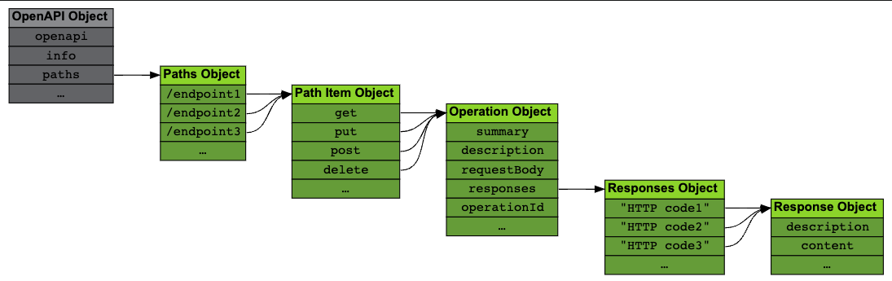

# API Endpoints

## Path Object (The Endpoints list)

API Endpoints (also called Operations or Routes) are called Paths in the OAS.

The [Paths Object](https://spec.openapis.org/oas/v3.1.0#paths-object), accessible through the paths field in the root [OpenAPI Object](https://spec.openapis.org/oas/v3.1.0#openapi-object).



Every field in the Paths Object is a [Path Item Object](https://spec.openapis.org/oas/v3.1.0#path-item-object) describing one API endpoint.

Paths <Color color="var(--secondary-font-color)"> must start with a forward slash `/` </Color> <Color color="var(--not-require-but-good-to-know-font-color)"> since they are directly appended to the server URL (described in the API Servers page) to construct the full endpoint URL </Color>.

<Admonition type="info" title="info">

The [Tic Tac Toe sample API](https://oai.github.io/Documentation/examples/tictactoe.yaml) is used in this guide to exemplify each concept and it is built piece by piece as the guide progresses.

</Admonition>

Here's the first snippet already containing a single endpoint:

<!-- prettier-ignore -->
```yaml title= showLineNumbers
openapi: 3.1.0
info:
  title: Tic Tac Toe
  description: |
    This API allows writing down marks on a Tic Tac Toe board
    and requesting the state of the board or of individual squares.
  version: 1.0.0
// highlight-start
paths:
  /board: 
    ...
// highlight-end
```

## Path Item Object

The [Path Item Object](https://spec.openapis.org/oas/v3.1.0#path-item-object) describes the <Color color="var(--secondary-font-color)"> HTTP operations </Color> that can be <Color color="var(--secondary-font-color)"> performed on a path </Color> with a separate [Operation Object](https://spec.openapis.org/oas/v3.1.0#operation-object) for each one.

Allowed operations match HTTP methods names like `get`, `put`, `delete` etc.

<Admonition type="tip" title="later">

This object also accepts <Color color="var(--secondary-font-color)"> common properties </Color> <Color color="var(--primary-font-color)"> for all operations on the path </Color> like `summary` or `description`.

</Admonition>

The details of each operation are given in each child Operation object.

<!-- prettier-ignore -->
```yaml title= showLineNumbers
paths:
  // highlight-start
  /board:
    get:
      ...
    put:
      ...
    // highlight-end
```

## Operation Object

Besides giving the operation a `summary` and a `description`, The [Operation Object](https://spec.openapis.org/oas/v3.1.0#operation-object) basically describes the operation's parameters, payload and possible server responses.

<!-- prettier-ignore -->
```yaml title= showLineNumbers
paths:
  /board:
    // highlight-start
    get:
      summary: Get the whole board
      description: Retrieves the current state of the board and the winner.
      parameters: 
        ...
      responses: 
        ...
      // highlight-end
```

## Response<Color color="var(--primary-font-color)">s</Color> Object

The [Responses Object](https://spec.openapis.org/oas/v3.1.0#responses-object) is a container for the expected answers the server can give to this request.

<!-- prettier-ignore -->
```yaml title= showLineNumbers
paths:
  /board:
    get:
      summary: ...
      description: ...
      // highlight-start
      responses:
        "200":
          ...
        "404":
          ...
        // highlight-end
```

Each field name is an <Color color="var(--secondary-font-color)"> HTTP response code </Color> enclosed in quotation marks and its value is a [Response Object](https://spec.openapis.org/oas/v3.1.0#response-object) (note there is no 's' at the end) containing details about the response.

<Admonition type="note" title="note">

At least one response must be given

It is recommended that it corresponds to the success case (typically HTTP response code 200).

</Admonition>

<Admonition type="tip" title="tip">

5 wildcards are allowed: 1XX, 2XX, 3XX, 4XX and 5XX (<Color color="var(--secondary-font-color)"> explicit codes take preference over wildcards </Color>).

</Admonition>

## Response Object

The Response Object contains a <Color color="var(--secondary-font-color)"> mandatory </Color> `description` of the meaning of the response in the context of this operation.

The `content` field describes the possible payloads of the response. Details of this field will be described in [Content of Message Bodies](message-body-content) page.

<!-- prettier-ignore -->
```yaml title= showLineNumbers
paths:
  /board:
    get:
      responses:
        // highlight-start
        "200":
          description: Everything went fine.
          content:
            ...
        // highlight-end
```

<br />

---

# Sources

- https://oai.github.io/Documentation/specification-paths.html
