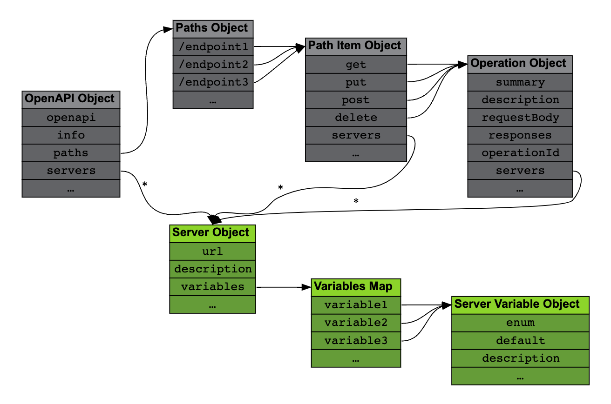

# API Servers

This page shows how to <Color color="var(--secondary-font-color)"> specify the server </Color> where the API can be accessed,
which can contain multiple URLs and even variable portions.

## Server Object

The [Server Object](https://spec.openapis.org/oas/v3.1.0#server-object) provides the <Color color="var(--secondary-font-color)"> base URLs where the API is being served </Color>.

It can be found in the `servers` array present in the root [OpenAPI Object](https://spec.openapis.org/oas/v3.1.0#oasServers), the [Path Item Object](https://spec.openapis.org/oas/v3.1.0#pathItemServers) and the [Operation Object](https://spec.openapis.org/oas/v3.1.0#operationServers).



<Admonition type="note" title="note">

The edges marked with an asterisk are arrays.

</Admonition>

Each element in a `servers` array is a Server Object providing, at least, a `url` field <Color color="var(--secondary-font-color)"> with the </Color> <Color color="var(--primary-font-color)"> base URL </Color> for that server.

An optional `description` aids in keeping server lists organized:

```yaml title= showLineNumbers
servers:
  - url: https://europe.server.com/v1
    description: Server located in Germany.
  - url: https://america.server.com/v1
    description: Server located in Atlanta, GA.
  - url: https://asia.server.com/v1
    description: Server located in Shenzhen
```

Individual API endpoints (as specified in the [Paths Object](https://spec.openapis.org/oas/v3.1.0#paths-object)) are then <Color color="var(--secondary-font-color)"> appended to this URL </Color> to construct the full endpoint URL.

For example:

```yaml title= showLineNumbers
servers:
  - url: https://server.com/v1
paths:
  /users:
    get:
```

When <Color color="var(--secondary-font-color)"> multiple </Color> `servers` arrays are specified at different levels for a given operation, <Color color="var(--secondary-font-color)"> only the lowest level </Color> one is taken into account.

For example:

```yaml title= showLineNumbers
servers:
  - url: https://server1.com
paths:
  /users:
    get:
      servers:
        - url: https://server2.com
```

GET requests to the `/users` endpoint are served from `https://server2.com` and not from `https://server1.com`.

<Admonition type="info" title="info">

If no servers are provided, it is assumed that all API endpoints are relative to the location where the OpenAPI document is being served.

</Admonition>

<Admonition type="tip" title="tip">

If the servers are used for different environments, chances are that their APIs will be different and <Color color="var(--secondary-font-color)"> describing them in </Color> <Color color="var(--primary-font-color)"> a single document </Color> <Color color="var(--secondary-font-color)"> will be complicated </Color>.

In these cases it is probably better to use different documents, and even different API versions.

</Admonition>

## Server Variables

Server URLs can contain variables, delimited by curly braces `{}`:

```yaml title= showLineNumbers
servers:
  - url: https://{username}.server.com:{port}/{version}
```

These variables must then be detailed in the `variables` field.

The `variables` field is a map pairing `variable` names and [Server Variable Objects](https://spec.openapis.org/oas/v3.1.0#server-variable-object).

The Server Variable Object has the following fields:

- `default` (string): A <Color color="var(--secondary-font-color)"> mandatory field </Color> and it is the value that should be used if there is no other value to provide.
- `enum` (array of strings): If present, this array lists the valid values for the variable ( <Color color="var(--primary-font-color)"> the default value must be in the array </Color> ).
- `description` (string): Descriptions of the variable.

```yaml title= showLineNumbers
servers:
  - url: https://{username}.server.com:{port}/{version}
    variables:
      username:
        default: demo
        description: This value is assigned by the service provider.
      port:
        enum:
          - "8443"
          - "443"
        default: "8443"
      version:
        default: v1
```

<br />

---

# Sources

- https://oai.github.io/Documentation/specification-servers.html
