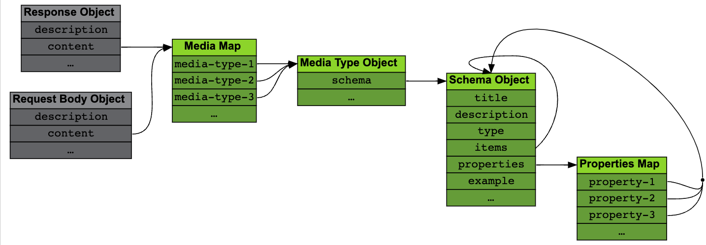

# Content of Message Bodies

## The `content` field

This field can be found both in [Response Objects](https://spec.openapis.org/oas/v3.1.0#response-object) and [Request Body Objects](https://spec.openapis.org/oas/v3.1.0#request-body-object).



This allows returning / accepting content in <Color color="var(--secondary-font-color)"> different formats </Color>, each one with a different structure described by the [Media Type Object](https://spec.openapis.org/oas/v3.1.0#media-type-object).

<Admonition type="note" title="note"> 

Wildcards are accepted for the media types, with the more specific ones taking precedence over the generic ones.

</Admonition>

<!-- prettier-ignore -->
```yaml title= showLineNumbers
content:
  application/json:
    ...
  text/html:
    ...
  text/*:
    ...
```

## Media Type Object

The [Media Type Object](https://spec.openapis.org/oas/v3.1.0#media-type-object) describes the <Color color="var(--secondary-font-color)"> structure of the content </Color> and <Color color="var(--secondary-font-color)"> provides examples </Color> for documentation and mocking purposes.

The structure is described in the `schema` field

<!-- prettier-ignore -->
```yaml title= showLineNumbers
content:
  application/json:
    schema:
      ...
```

## Schema Object

The [Schema Object](https://spec.openapis.org/oas/v3.1.0#schema-object) <Color color="var(--secondary-font-color)"> defines a data type </Color> which can be a primitive (integer, string, …), an array or an object depending on its `type` field.

`type` is a string(YAML format) and its possible values are:

- `number`
- `string`
- `boolean`
- `array`
- `object`

Depending on the selected type, a number of other fields are available to further specify the data format.

Example integer with limited range:

```yaml title= showLineNumbers
content:
  application/json:
    schema:
      type: integer
      minimum: 1
      maximum: 100
```

Example string with only three valid options:

```yaml title= showLineNumbers
content:
  application/json:
    schema:
      type: string
      enum:
        - Alice
        - Bob
        - Carl
```

### Array type

Array types must have an `items` field, which is a [Schema Object](https://spec.openapis.org/oas/v3.1.0#schema-object) itself.

```yaml title= showLineNumbers
content:
  application/json:
    schema:
      type: array
      minItems: 1
      maxItems: 10
      items:
        type: integer
```

<Admonition type="note" title="note">

**<Color color="var(--writer-additional-note-font-color)"> //\\\\ </Color>** All items inside array have to be the same type.

It means you can only define a single `items`'s type per array.

</Admonition>

<Admonition type="info" title="info">

The size of the array can be limited with `minItems` and `maxItems`.

</Admonition>

### Object type

Object types <Color color="var(--secondary-font-color)"> must have </Color> a `properties` field listing the properties of the object.

This field is a key-value pairing property names (as a key) with a [Schema Object](https://spec.openapis.org/oas/v3.1.0#schema-object)(as a value).

Here's an example defining an object with two fields: a `productName` string and a `productPrice` number:

```yaml title= showLineNumbers
content:
  application/json:
    schema:
      type: object
      properties:
        productName:
          type: string
        productPrice:
          type: number
```

### <Color color="var(--not-require-but-good-to-know-font-color)"> Example </Color>

From [Tic Tac Toe sample API](https://oai.github.io/Documentation/examples/tictactoe.yaml)

```yaml title= showLineNumbers
openapi: 3.1.0
info:
  title: Tic Tac Toe
  description: |
    This API allows writing down marks on a Tic Tac Toe board
    and requesting the state of the board or of individual squares.
  version: 1.0.0
paths:
  # Whole board operations
  /board:
    get:
      summary: Get the whole board
      description: Retrieves the current state of the board and the winner.
      responses:
        "200":
          description: "OK"
          content:
            application/json:
              schema:
                type: object
                properties:
                  winner:
                    type: string
                    enum: [".", "X", "O"]
                    description: |
                      Winner of the game. `.` means nobody has won yet.
                  board:
                    type: array
                    maxItems: 3
                    minItems: 3
                    items:
                      type: array
                      maxItems: 3
                      minItems: 3
                      items:
                        type: string
                        enum: [".", "X", "O"]
                        description: |
                          Possible values for a board square.
                          `.` means empty square.
```

The response contains an object is JSON format with two fields:

- `winner` is a string with only three possible values: `.`, `X` and `O`.
- `board` is a 3-element array where each item is another 3-element array, effectively building a 3x3 square matrix.
  Each element in the matrix is a string with only three possible values: `.`, `X` and `O`.

<br />

---

# Sources

- https://oai.github.io/Documentation/specification-content.html
