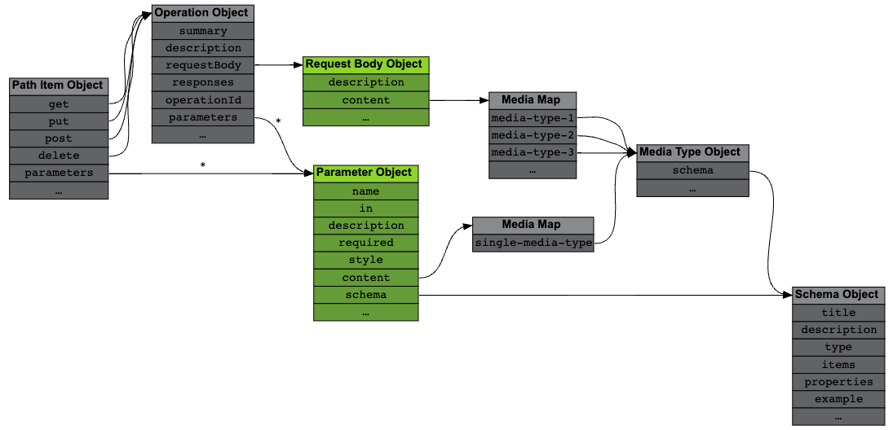

# Parameters and Operation Payload

OpenAPI provides two mechanisms to specify input data, parameters and request body (message payload).

&#8203;<Color color="var(--not-require-but-good-to-know-font-color)"> Parameters are typically used to identify a resource, whereas the message payload provides content for that resource. </Color>



<Admonition type="info" title="info">

The edges marked with an asterisk(\*) are arrays.

</Admonition>

## Parameter Object

The `parameters` field in the [Path Item](https://spec.openapis.org/oas/v3.1.0#path-item-object) and [Operation Objects](https://spec.openapis.org/oas/v3.1.0#operation-object) is an array containing [Parameter Objects](https://spec.openapis.org/oas/v3.1.0#parameter-object).

When <Color color="var(--secondary-font-color)"> provided in the Path Item Object </Color>, the <Color color="var(--secondary-font-color)"> parameters are shared by all operations on that path </Color> (which can override individual parameters at the Operation Object level but not remove them).

Each Parameter Object describes one parameter with the following mandatory fields:

- `in` (string): [Location of the parameter](#parameter-location)
- `name` (string): Case-sensitive. <Color color="var(--primary-font-color)"> Must be unique in each location </Color>.

Additional optional fields include:

- `description` (string): Useful for documentation. Might contain usage examples, for instance.
- `required` (boolean): Whether this parameter must be present or not. The default value is false.

### Parameter Location

Parameters can reside in different locations, indicated by the `in` field. The most common ones are:

#### `path`

The parameter is <Color color="var(--secondary-font-color)"> part of the route </Color> of this operation.

The <Color color="var(--secondary-font-color)"> parameter's name must appear in the path as a [template expression](https://spec.openapis.org/oas/v3.1.0#path-templating) </Color>, i.e., delimited by curly braces `{}`.

For example, the path `/users/{id}` must contain at least one parameter described with:

```yaml title= showLineNumbers
paths:
  /users/{id}:
    get:
      parameters:
        - name: id
          // highlight-start
          in: path
          required: true
          // highlight-end
```

<Admonition type="caution" title="caution">

When using `path` parameters, the `required` field must be present and its value must be `true`.

</Admonition>

#### `query`

The parameter is appended to the <Color color="var(--secondary-font-color)"> query string </Color> part of the operation's URL.

For example, the URL `/users?id=1234` can be parsed using:

```yaml title= showLineNumbers
paths:
  /users:
    get:
      parameters:
        - name: id
        // highlight-next-line
          in: query
```

#### `header`

The parameter is sent in a custom HTTP header as part of the request.

<Admonition type="note" title="note">

Header names are case-<Color color="var(--secondary-font-color)">in</Color>sensitive.

</Admonition>

### Parameter Type

Most of the time a parameter's type can be specified by using a [Schema Object](https://spec.openapis.org/oas/v3.1.0#schemaObject) in the schema field.

```yaml title= showLineNumbers
parameters:
  - name: id
    in: query
    // highlight-start
    schema:
      type: integer
      minimum: 1
      maximum: 100
    // highlight-end
```

<Admonition type="info" title="info">

The [Content of Message Bodies](message-body-content#schema-object) page describes Schema objects in greater detail.

</Admonition>

In more advanced scenarios the `content` field can be used instead.

It provides a <Color color="var(--secondary-font-color)"> single-entry map </Color>(map that have only 1 key-value) of Media Types(as a key) to [Media Type Objects](https://spec.openapis.org/oas/v3.1.0#media-type-object)(as a value).

<Admonition type="note" title="note">

&#8203;<Color color="var(--secondary-font-color)">Exactly one</Color> of `schema` or `content` must be present. They cannot appear at the same time.

</Admonition>

### <Color color="var(--can-not-understand-font-color)"> Parameter Serialization Control </Color>

<Admonition type="caution" title="??????">

https://oai.github.io/Documentation/specification/parameters.html#parameter-serialization-control

</Admonition>

## Request Body Object

&#8203;<Color color="var(--not-require-but-good-to-know-font-color)"> When updating a record on a database, the parameters are typically used to identify the record whereas the message body provides its new content. </Color>

The [Request Body Object](https://spec.openapis.org/oas/v3.1.0#request-body-object) is specified through the `requestBody` field in the [Operation Object](https://spec.openapis.org/oas/v3.1.0#operationRequestBody).

<!-- prettier-ignore -->
```yaml title= showLineNumbers
paths:
  /board:
    put:
      // highlight-start
      requestBody: 
        ...
      // highlight-end
```

<Admonition type="info" title="info">

The only mandatory field in the Request Body Object is `content` which is described in detail in the [Content of Message Bodies](message-body-content#schema-object) page.

</Admonition>

<Admonition type="note" title="note">

The Request Body Object also has a `description` string and a `required` boolean to state whether the message payload is mandatory.

</Admonition>

&#8203;<Color color="var(--not-require-but-good-to-know-font-color)"> As a reminder, the snippet below describes an operation with a JSON request body containing a single integer with values between 1 and 100. </Color>

```yaml title= showLineNumbers
requestBody:
  content:
    application/json:
      schema:
        type: integer
        minimum: 1
        maximum: 100
```

## <Color color="var(--not-require-but-good-to-know-font-color)"> Example </Color>

The [Tic Tac Toe sample API](https://oai.github.io/Documentation/examples/tictactoe.yaml) contains two endpoints

- one without parameters or request body (`/board`)
- another one with both (`/board/{row}/{column}`).

<!-- prettier-ignore -->
```yaml title= showLineNumbers
paths:
  # Single square operations
  /board/{row}/{column}:
    parameters:
      - name: row
        in: path
        required: true
        schema:
          type: integer
          minimum: 1
          maximum: 3
      - name: column
        in: path
        required: true
        schema:
          type: integer
          minimum: 1
          maximum: 3
    get:
      summary: Get a single board square
      responses: ...
    put:
      summary: Set a single board square
      requestBody:
        required: true
        content:
          application/json:
            schema:
              type: string
              enum: [".", "X", "O"]
      responses: 
        ...
```

<br />

---

# Sources

- https://oai.github.io/Documentation/specification/parameters.html
