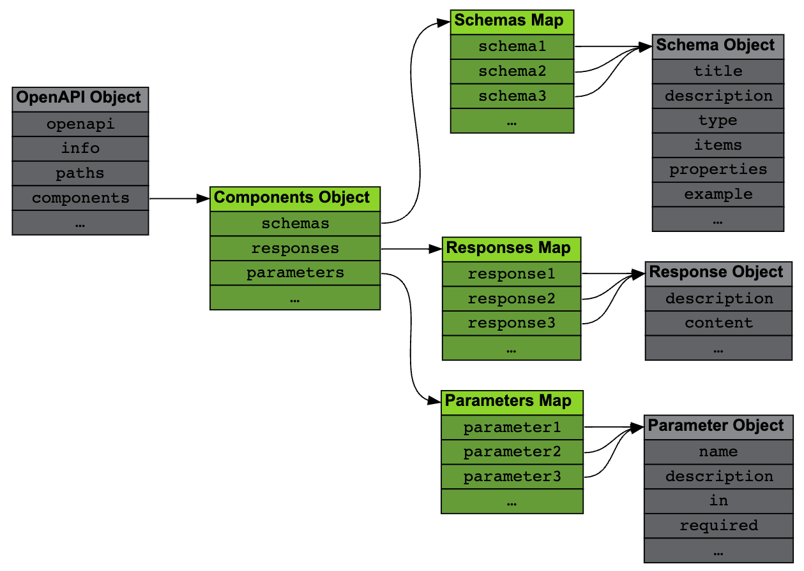

# Reusing Descriptions

This page introduces a mechanism to remove redundancy from an OpenAPI document by reusing portions of it.

## Components Object

The [Components Object](https://spec.openapis.org/oas/v3.1.0#components-object), accessible through the `components` field in the root [OpenAPI Object](https://spec.openapis.org/oas/v3.1.0#openapi-object).

It contains <Color color="var(--secondary-font-color)"> definitions for objects to be reused </Color> in other parts of the document.



<Admonition type="info" title="info">

Most objects(but not all) in an OpenAPI document can be replaced by a reference to a component.

</Admonition>

Each field in the Components Object is a map pairing <Color color="var(--secondary-font-color)"> component names </Color>(as a key) with objects(as a value) to be reused.

The <Color color="var(--secondary-font-color)"> type of these objects must match the parent field </Color>, e.g. objects in the `schemas` map must be Schema Objects.

```yaml title= showLineNumbers
components:
  schemas:
    coordinate:
      type: integer
      minimum: 1
      maximum: 3
  parameters:
    rowParam:
      name: row
      in: path
      required: true
```

The above example defines two components:

- `coordinate` is a schema component, usable wherever a [Schema Object](https://spec.openapis.org/oas/v3.1.0#schema-object) is expected.
- `rowParam` is a parameter component, usable wherever a [Parameter Object](https://spec.openapis.org/oas/v3.1.0#parameter-object) is expected.

## Reference Object

Any OpenAPI object of the types <Color color="var(--secondary-font-color)"> supported by </Color> the Components Object can be replaced by a [Reference Object](https://spec.openapis.org/oas/v3.1.0#reference-object) pointing to a component.

Reference Objects are actually [JSON References](https://tools.ietf.org/html/draft-pbryan-zyp-json-ref-03)

They contain <Color color="var(--secondary-font-color)"> a single field </Color> named `$ref` and its string value is a <Color color="var(--secondary-font-color)"> URI pointing to the referenced object </Color>:

```yaml title= showLineNumbers
$ref: "https://gigantic-server.com/schemas/Monster/schema.yaml"
```

References can be absolute or relative, and they can include a fragment identifier

```yaml title= showLineNumbers
$ref: "./another_file.yaml#rowParam"
```

### Example

```yaml title= showLineNumbers
components:
  schemas:
    coordinate:
      type: integer
      minimum: 1
      maximum: 3
  parameters:
    rowParam:
      name: row
      in: path
      required: true
      schema:
        $ref: "#/components/schemas/coordinate"
    columnParam:
      name: column
      in: path
      required: true
      schema:
        $ref: "#/components/schemas/coordinate"
paths:
  /board/{row}/{column}:
    parameters:
      - $ref: "#/components/parameters/rowParam"
      - $ref: "#/components/parameters/columnParam"
```

<Color color="var(--not-require-but-good-to-know-font-color)">

Note how all references point to different fragments inside the same document (the one being processed).

Note also how the coordinate schema is used twice (in the rowParam and columnParam parameters), and how these two parameters are referenced from the `/board/{row}/{column}` path.

</Color>

<br />

---

# Sources

- https://oai.github.io/Documentation/specification/components.html
