## Defining grid template column

```css title= showLineNumbers
.container {
  display: grid;
  grid-template-columns: 100px 100px 100px;
  grid-gap: 20px;
}
```

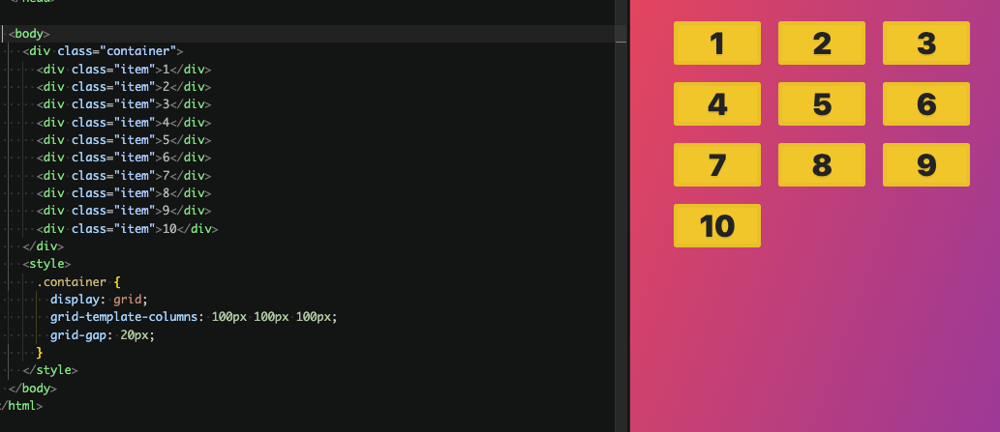

`grid-template-columns: 100px 100px 100px;` means create 3 columns layout inside grid container. first column width is 100px. second column width is 100px. third column width is 100px

grid's children will be assigned one by one to each defined columns.

if there is more children than the number of defined column, they will be assgined to the new rows

## Defining grid template row

```css title= showLineNumbers
.container {
  display: grid;
  grid-template-rows: 100px 200px 300px;
  grid-gap: 20px;
}
```

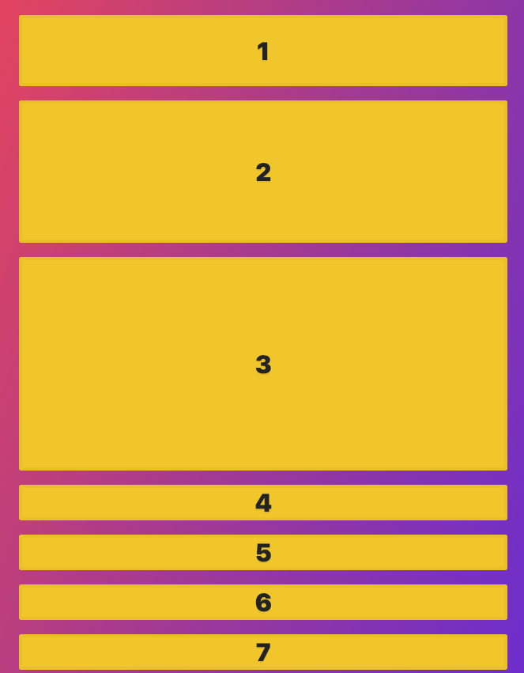

meaning first row height is 100px. second row height is 200px. third row height is 300px.

the height of any exceeding rows (4th row, 5th row, etc.) will be automatically set.

<Admonition type="note" title="note">

Define only `grid-template-rows` without `grid-template-columns` will automatically set to be one column layout

</Admonition>

<Admonition type="info" title="info">

Defining both

```css title= showLineNumbers
.container {
  display: grid;
  grid-template-columns: 200px 500px;
  grid-template-rows: 200px 100px 400px;
  grid-gap: 20px;
}
```

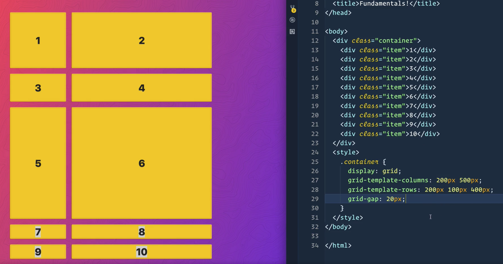

</Admonition>

## auto flow

property `grid-auto-flow` controls how items get placed into the grid.

### row

the default value is `row`, which means items will be placed to fill each row before moving to the next row.

```css title= showLineNumbers
.container {
  display: grid;
  grid-gap: 20px;
  grid-template-columns: 100px 100px 100px;
  grid-template-rows: 100px 100px 100px;
  /* highlight-next-line */
  grid-auto-flow: row;
}
```

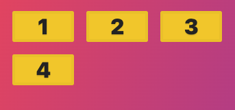

### column

value `column` means items will be placed to fill each column before moving to the next column.

```css title= showLineNumbers
.container {
  display: grid;
  grid-gap: 20px;
  grid-template-columns: 100px 100px 100px;
  grid-template-rows: 100px 100px 100px;
  /* highlight-next-line */
  grid-auto-flow: column;
}
```

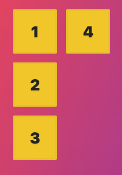

## implicit and explicit grid

```css title= showLineNumbers
.container {
  display: grid;
  grid-template-columns: 100px 100px 100px;
  grid-template-rows: 100px 200px;
  grid-gap: 20px;
}
```

It means we explitly defined 3 columns and 2 rows, which is called explicit grid.

any grid items that are placed outside of the explicit grid are the implicit grid.

eg. 1,2,3,4,5,6 are placed in the explicit grid. 7,8,9 and 10 are placed in the implicit grid.

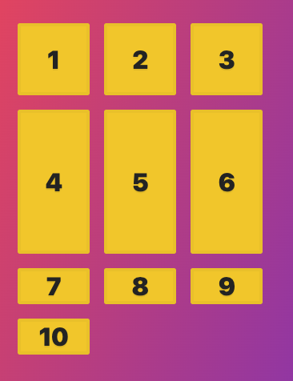

### defining implicit rows' height

```css title= showLineNumbers
.container {
  display: grid;
  grid-template-columns: 100px 100px 100px;
  grid-template-rows: 100px 200px;
  grid-gap: 20px;
  /* highlight-next-line */
  grid-auto-rows: 150px 200px 250px;
}
```

`grid-auto-rows: 150px 200px 250px;` means the height of each implicit row will cycle through these values.

eg, 1st implicit row height is 150px, 2nd is 200px, 3rd is 250px,
then 4th is 150px, 5th is 200px, 6th is 250px, etc.

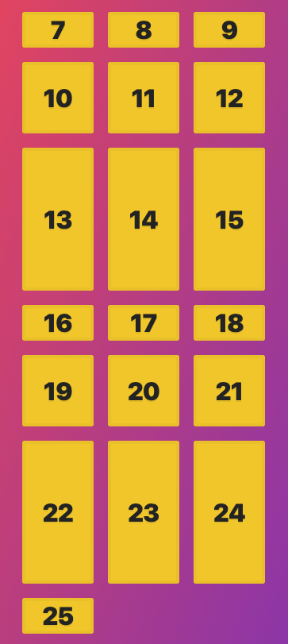

### defining implicit columns' width

`grid-auto-columns` then can be used with `grid-auto-flow: column;`

```css title= showLineNumbers
.container {
  display: grid;
  grid-gap: 20px;
  grid-template-columns: 100px 100px 100px;
  grid-auto-flow: column;
  /* highlight-next-line */
  grid-auto-columns: 150px 50px;
}
```


## fr unit

use `fr` unit to make the grid item take up the available space.

```css title= showLineNumbers
.container {
  display: grid;
  grid-gap: 20px;
  grid-template-columns: 100px 1fr 100px;
}
```

means the middle column will take up the remaining space after the first and third column take 100px each.

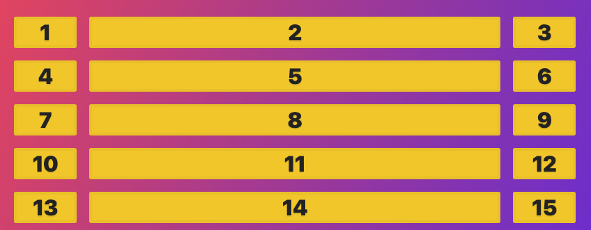

<Admonition type="note" title="note">

`fr` is propotional unit

```css title= showLineNumbers
.container {
  display: grid;
  grid-gap: 20px;
  grid-template-columns: 100px 1fr 2fr;
}
```

means the second column will take 1 part of the remaining space, and the third column will take 2 parts of the remaining space.

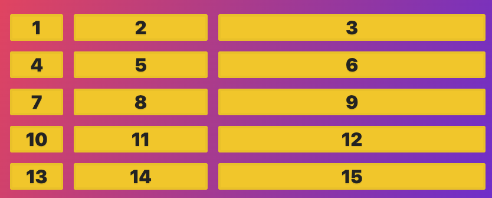

</Admonition>

## sizing grid items

by defaut, grid items will stretch to fill the entire grid area.

but the item can specify its width and height to make it smaller or larger than the grid area.


<Tabs>
<TabItem value="column" label="overflow column">

```css title="overflow-column" showLineNumbers
.container {
  display: grid;
  grid-gap: 20px;
  /* highlight-next-line */
  grid-template-columns: repeat(3, 100px);
}

.item:nth-child(2) {
  background-color: red;
  /* highlight-next-line */
  width: 300px;
}
```

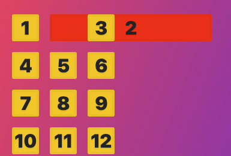

</TabItem>
<TabItem value="row" label="overflow row">

```css title="overflow-row" showLineNumbers
.container {
  display: grid;
  grid-gap: 20px;
  /* highlight-next-line */
  grid-template-rows: repeat(3, 50px);
}

.item:nth-child(2) {
  background-color: green;
  /* highlight-next-line */
  height: 300px;
}
```

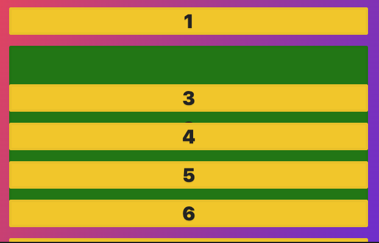

</TabItem>
</Tabs>

### when grid template columns and rows sizes are dynamic

grid

```css title= showLineNumbers
.container {
  display: grid;
  grid-gap: 20px;
  /* highlight-next-line */
  grid-template-columns: repeat(3, 1fr);
}

.item:nth-child(2) {
  background-color: green;
  width: 300px;
}
```

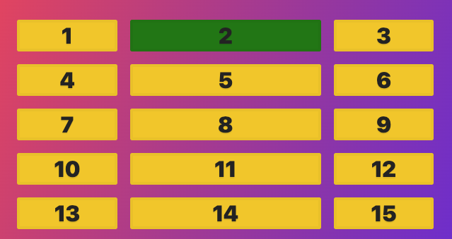

### size item base on its content

```css title= showLineNumbers
.container {
  display: grid;
  grid-gap: 20px;
  grid-template-columns: auto auto 1fr;
}
```

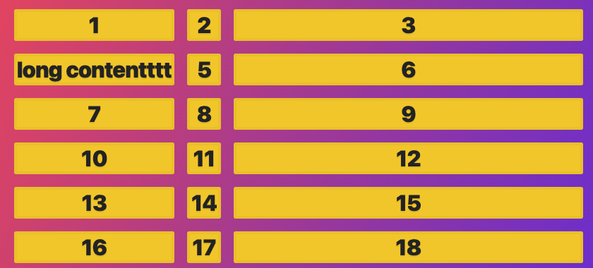

## repeat function

can be used in `grid-template-columns` and `grid-template-rows` to avoid writing repeated values.

```css title= showLineNumbers
.container {
  display: grid;
  grid-gap: 20px;
  /* highlight-next-line */
  grid-template-columns: repeat(3, 50px 1fr);
}
```

equvilant to

```css title= showLineNumbers
grid-template-columns: 50px 1fr 50px 1fr 50px 1fr;
```

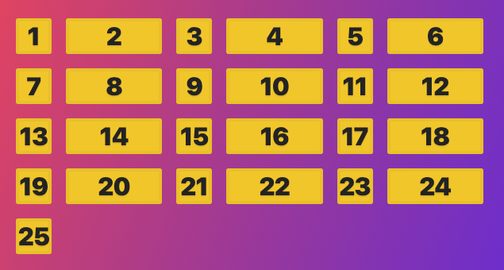

<br />

---

# Sources

- https://cssgrid.io/
