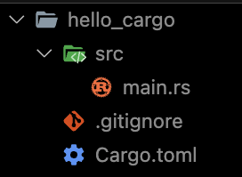

# Cargo

Cargo is Rust's build tool and package manager.

## Crete project using Cargo

```bash title=
cargo new <project name>
```

<Admonition type="info" title="info">

Use `--lib` option to create library crate.

Eg. `cargo new restaurant --lib`

</Admonition>



Cargo also initialize a new Git repository along with a `.gitignore` file.

<Admonition type="info" title="info">

Git files won’t be generated if you run cargo new within an existing Git repository.

You can override this behavior by using `--vcs=git` option

</Admonition>

## `Cargo.toml`

`Cargo.toml` is the manifest file for Rust. It's where you keep <Color color="var(--secondary-font-color)"> metadata for your project </Color>, as well as <Color color="var(--secondary-font-color)"> dependencies </Color>.

```toml title=Cargo.toml showLineNumbers
[package]
name = "hello_cargo"
version = "0.1.0"
edition = "2021"

# See more keys and their definitions at https://doc.rust-lang.org/cargo/reference/manifest.html

[dependencies]
```

`[dependencies]` section is the start of a section for you to list any of your project’s dependencies.

## Adding dependencies

```bash title=
cargo add <crate name>[@<crate version>]
```

```bash title=
cargo add ferris-says@0.2
```

<Admonition type="info" title="info">

In Rust, packages of code are referred to as crates.

[crates.io](https://crates.io/) is a Rust package registry

</Admonition>

## Project structure


Cargo expects your source files to live inside the src directory.

The top-level project directory is just for README files, license information, configuration files, and anything else not related to your code

## Building and Running a Cargo Project

### Build

From project's root directory, run:

```bash title=
cargo build
```

This command creates an executable file in `target/debug/hello_cargo` rather than in your current directory.

Because the <Color color="var(--secondary-font-color)"> default build is a debug build </Color>, Cargo puts the binary in a directory named `debug`.

<Admonition type="info" title="info">

Running cargo build for the first time also causes Cargo to create a new file at the top level: `Cargo.lock`.

This file keeps track of the <Color color="var(--secondary-font-color)"> exact versions of dependencies </Color> in your project.

</Admonition>

### Run

```bash title= showLineNumbers
./target/debug/hello_cargo
```

### Use Cargo to build and run

We can also use cargo run to compile the code and then run the resultant executable all in one command:

```bash title=
cargo run
```

## Check for valid complie

```bash title=
cargo check
```

This command quickly checks your code to make sure it compiles but <Color color="var(--secondary-font-color)"> doesn't produce an executable </Color>

Cargo check is much faster than `cargo build` because it skips the step of producing an executable

## Build for Release

When your project is finally ready for release, you can use `cargo build --release` to compile it <Color color="var(--secondary-font-color)"> with optimizations </Color>.

This command will create an executable in `target/release` instead of `target/debug`. The optimizations make your Rust code run faster,

<br />

---

# Sources

- https://doc.rust-lang.org/book/ch01-03-hello-cargo.html
