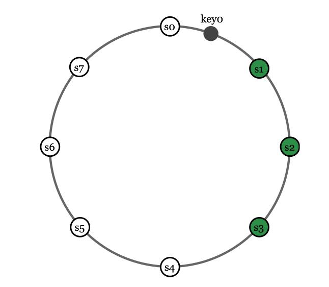

---
last_update:
  date: 2026-06-10T12:52:07.479Z
---

for high availability and reliability, in the same shard group, a data can be stored on multiple shard instead of a single shard

after a key is mapped to a position on the hash ring, walk clockwise from that position and choose the first N servers on the ring to store data copies

eg (N = 3) . data is replicated over 3 shard

with virtual node, data might be replicate on the same server. so walking on the ring must matched on unique server

<Admonition type="note" title="note"> 

sharding instance can be placed on different data center to avoid data center's failure

</Admonition>

 

---

# Sources

- https://bytebytego.com/courses/system-design-interview/design-a-key-value-store