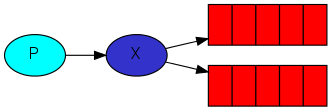
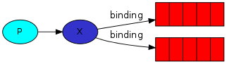
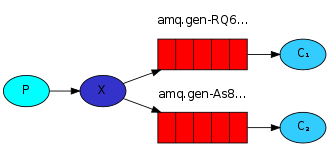

In the previous tutorial we created a work queue. The assumption behind a work queue is that each task is delivered to exactly one worker.

In this part we'll do something completely different. We'll deliver <span style={{color: "var(--secondary-font-color)"}}> a message </span> to <span style={{color: "var(--secondary-font-color)"}}> multiple consumers </span>.

This pattern is known as "publish/subscribe".

To illustrate the pattern, we're going to build a simple logging system. It will consist of two programs -- the first will emit log messages and the second will receive and print them.

In our logging system every running copy of the receiver program will get the messages. That way we'll be able to run one receiver and direct the logs to disk; and at the same time we'll be able to run another receiver and see the logs on the screen.

Essentially, published log <span style={{color: "var(--secondary-font-color)"}}> messages are </span> going to be <span style={{color: "var(--secondary-font-color)"}}> broadcast to </span> <span style={{color: "var(--primary-font-color)"}}> all </span> the <span style={{color: "var(--secondary-font-color)"}}> receivers </span>.

## Exchanges

The core idea in the messaging model in RabbitMQ is that the <span style={{color: "var(--secondary-font-color)"}}> producer never sends any messages directly to a queue </span>. Actually, quite often the producer doesn't even know if a message will be delivered to any queue at all.

Instead, the producer can only send messages to an exchange.

An exchange is a very simple thing. On one side it receives messages from producers and the other side it pushes them to queues.

The exchange must know exactly what to do with a message it receives.

- Should it be appended to a particular queue?
- Should it be appended to many queues?
- Should it get discarded?.

The rules for that are defined by the `exchange type`.



There are a few exchange types available: `direct`, `topic`, `headers` and `fanout`. We'll focus on the last one -- the `fanout`.

Let's create an exchange of this type, and call it `logs`:

``` javascript
channel.assertExchange("logs", "fanout", { durable: false });
```

The `fanout` exchange is very simple. It just <span style={{color: "var(--secondary-font-color)"}}> broadcasts all the messages it receives to all the queues it knows </span>.

### Default exchange

In previous parts of the tutorial we knew nothing about exchanges, but still were able to send messages to queues. That was possible because we were using a default exchange, which is identified by the empty string `""`.

Recall how we published a message before:

``` javascript
channel.sendToQueue("hello", Buffer.from("Hello World!"));
```

Here we use the default or nameless exchange: messages are routed to the queue with the name specified as first parameter, if it exists.

### Publish message to exchange

Now, we can publish to our named exchange:

``` javascript
channel.publish("logs", "", Buffer.from("Hello World!"));
```

The empty string as second parameter means that we don't want to send the message to any specific queue. We want only to publish it to our `logs` exchange.

<Tip>

To list the exchanges on the server you can run the ever useful `rabbitmqctl`:

``` bash
sudo rabbitmqctl list_exchanges
```

In this list there will be some `amq.*` exchanges and the default (unnamed) exchange.

These are created by default, but it is unlikely you'll need to use them at the moment.

</Tip>

## Temporary queues

As you may remember previously we were using queues that had specific names.
Giving a queue a name is important when you want to share the queue between producers and consumers.

But that's not the case for our logger. We want to hear about all log messages, not just a subset of them. We're also interested only in currently flowing messages not in the old ones.

To solve that we need two things.

1. Whenever we connect to Rabbit we need a fresh, empty queue. To do this we could create a queue with a random name, or, even better - let the server choose a random queue name for us.
1. Once we disconnect the consumer the queue should be automatically deleted.

In the `amqp.node` client, when we supply queue name as an empty string, we create a non-durable queue with a generated name:

``` javascript lines
channel.assertQueue("", {
  exclusive: true,
});
```

When the method returns, the queue instance contains a random queue name generated by RabbitMQ. eg. `amq.gen-JzTY20BRgKO-HjmUJj0wLg`

&#8203;<span style={{color: "var(--secondary-font-color)"}}> When the connection that declared it closes, the queue will be deleted </span> because it is declared as exclusive.

<Tip>

You can learn more about the exclusive flag and other queue properties in the [guide on queues](https://www.rabbitmq.com/queues.html).

</Tip>

## Bindings

We've already created a fanout exchange and a queue. Now we need to tell the exchange to send messages to our queue.

That relationship between exchange and a queue is called a binding.



``` javascript
channel.bindQueue(queue_name, "logs", "");
```

From now on the `logs` exchange will append messages to our queue.

<Tip>

You can list existing bindings using

``` bash
rabbitmqctl list_bindings
```

</Tip>

## Putting it all together



The producer program, which emits log messages, doesn't look much different from the [previous tutorial](work-queues). The most important change is that we now want to publish messages to our logs exchange.

We need to supply a routing key when sending a message to exchange, but its value is ignored for `fanout` exchanges.

Here goes the code for publisher, `emit_log.js` script:

``` javascript title="emit_log.js" lines
var amqp = require("amqplib/callback_api");

amqp.connect("amqp://localhost", function (error0, connection) {
  if (error0) {
    throw error0;
  }
  connection.createChannel(function (error1, channel) {
    if (error1) {
      throw error1;
    }
    var exchange = "logs";
    var msg = process.argv.slice(2).join(" ") || "Hello World!";

    channel.assertExchange(exchange, "fanout", {
      durable: false,
    });
    channel.publish(exchange, "", Buffer.from(msg));
    console.log(" [x] Sent %s", msg);
  });

  setTimeout(function () {
    connection.close();
    process.exit(0);
  }, 500);
});
```

As you see, after establishing the connection we declared the exchange. This step is necessary as publishing to a non-existing exchange is forbidden.

<Danger>

The messages will be lost if no queue is bound to the exchange yet.

</Danger>

But that's okay for us in this case; if no consumer is listening yet we can safely discard the message.

``` javascript title="receive_logs.js" lines
var amqp = require("amqplib/callback_api");

amqp.connect("amqp://localhost", function (error0, connection) {
  if (error0) {
    throw error0;
  }
  connection.createChannel(function (error1, channel) {
    if (error1) {
      throw error1;
    }
    var exchange = "logs";

    channel.assertExchange(exchange, "fanout", {
      durable: false,
    });

    channel.assertQueue(
      "",
      {
        exclusive: true,
      },
      function (error2, q) {
        if (error2) {
          throw error2;
        }
        console.log(
          " [*] Waiting for messages in %s. To exit press CTRL+C",
          q.queue
        );
        channel.bindQueue(q.queue, exchange, "");

        channel.consume(
          q.queue,
          function (msg) {
            if (msg.content) {
              console.log(" [x] %s", msg.content.toString());
            }
          },
          {
            noAck: true,
          }
        );
      }
    );
  });
});
```

## Running tutorial code

To save logs to files:

``` bash
node receive_logs.js > logs_from_rabbit.log
```

Print logs to screen

``` bash
node receive_logs.js
```

Then emit the logs:

``` bash
node emit_log.js
```

Using `rabbitmqctl list_bindings` you can verify that the code actually creates bindings and queues as we want.

With two `receive_logs.js` programs running you should see something like:

``` text lines
sudo rabbitmqctl list_bindings
# => Listing bindings ...
# => logs    exchange        amq.gen-JzTY20BRgKO-HjmUJj0wLg  queue           []
# => logs    exchange        amq.gen-vso0PVvyiRIL2WoV3i48Yg  queue           []
# => ...done.
```

<br />

---

# Sources

- https://www.rabbitmq.com/tutorials/tutorial-three-javascript.html
