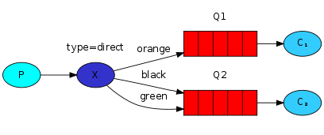
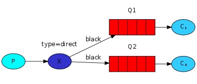

In this tutorial we're going to make it possible to subscribe only to a <span style={{color: "var(--secondary-font-color)"}}> subset of the messages </span>.

For example, we will be able to direct <span style={{color: "var(--secondary-font-color)"}}> only critical </span> error <span style={{color: "var(--secondary-font-color)"}}> messages </span> to the log file (to save disk space),
while still being able to print <span style={{color: "var(--secondary-font-color)"}}> all </span> of the <span style={{color: "var(--secondary-font-color)"}}> log messages on the console </span>.

## Bindings

A binding is a relationship between an exchange and a queue. This can be simply read as: the queue is interested in messages from this exchange.

Bindings can take an extra binding key parameter:

``` javascript lines highlight={4}
channel.bindQueue(
  queue_name,
  exchange_name,
  "black"
);
```

The meaning of a binding key depends on the exchange type.

<Note>

The fanout exchanges simply ignored binding key value.

</Note>

## Direct exchange

Our logging system from the previous tutorial broadcasts all messages to all consumers.
We want to extend that to allow <span style={{color: "var(--secondary-font-color)"}}> filtering messages </span> based on their severity.

We will use a `direct` exchange. The routing algorithm behind a direct exchange is simple

- A message goes to the queues whose <span style={{color: "var(--primary-font-color)"}}> binding key </span> <span style={{color: "var(--secondary-font-color)"}}> exactly matches </span> the <span style={{color: "var(--primary-font-color)"}}> routing key </span> of the message.



In this setup, we can see the direct exchange `X` with two queues bound to it.

The first queue is bound with binding key `orange`, and the second has two bindings, `black` and `green`.

In such a setup a message published to the exchange with a routing key `orange` will be routed to queue `Q1`.

Messages with a routing key of `black` or `green` will go to `Q2`.

<Warning>

In this setup, all other messages without binding key will be discarded.

</Warning>

## Multiple bindings



It is perfectly legal to <span style={{color: "var(--secondary-font-color)"}}> bind multiple queues </span> with the <span style={{color: "var(--secondary-font-color)"}}> same binding key </span>.

In our example we could add a binding between `X` and `Q1` with binding key `black`.

In that case, the direct exchange will <span style={{color: "var(--secondary-font-color)"}}> behave like fanout </span> and will <span style={{color: "var(--secondary-font-color)"}}> broadcast the message to all the <span style={{color: "var(--primary-font-color)"}}> matching </span> queues </span>.

## Publishing / Subscribing messages

We'll use this model for our logging system. Instead of `fanout` we'll send messages to a `direct` exchange.

We will supply the log severity as a routing key. That way the receiving script will be able to select the severity it wants to receive.

### Publishing

Creating exchange:

``` javascript lines
var exchange = "direct_logs";

channel.assertExchange(exchange, "direct", {
  durable: false,
});
```

Publishing message:

``` javascript lines highlight={6}
var exchange = "direct_logs";

channel.assertExchange(exchange, "direct", {
  durable: false,
});
channel.publish(exchange, severity, Buffer.from(msg));
```

To simplify things we will assume that `severity` can be one of `info`, `warning`, `error`.

All code of publisher:

``` javascript title="emit_log_direct.js" lines
var amqp = require("amqplib/callback_api");

amqp.connect("amqp://localhost", function (error0, connection) {
  if (error0) {
    throw error0;
  }
  connection.createChannel(function (error1, channel) {
    if (error1) {
      throw error1;
    }
    var exchange = "direct_logs";
    var args = process.argv.slice(2);
    var msg = args.slice(1).join(" ") || "Hello World!";
    var severity = args.length > 0 ? args[0] : "info";

    channel.assertExchange(exchange, "direct", {
      durable: false,
    });
    channel.publish(exchange, severity, Buffer.from(msg));
    console.log(" [x] Sent %s: '%s'", severity, msg);
  });

  setTimeout(function () {
    connection.close();
    process.exit(0);
  }, 500);
});
```

### Subscribing

Receiving messages will work just like in the previous tutorial, with one exception - we're going to create a new binding for each severity we're interested in.

``` javascript title="receive_logs_direct.js" lines highlight={35-37}
var amqp = require("amqplib/callback_api");

var args = process.argv.slice(2);

if (args.length == 0) {
  console.log("Usage: receive_logs_direct.js [info] [warning] [error]");
  process.exit(1);
}

amqp.connect("amqp://localhost", function (error0, connection) {
  if (error0) {
    throw error0;
  }
  connection.createChannel(function (error1, channel) {
    if (error1) {
      throw error1;
    }
    var exchange = "direct_logs";

    channel.assertExchange(exchange, "direct", {
      durable: false,
    });

    channel.assertQueue(
      "",
      {
        exclusive: true,
      },
      function (error2, q) {
        if (error2) {
          throw error2;
        }
        console.log(" [*] Waiting for logs. To exit press CTRL+C");

        args.forEach(function (severity) {
          channel.bindQueue(q.queue, exchange, severity);
        });

        channel.consume(
          q.queue,
          function (msg) {
            console.log(
              " [x] %s: '%s'",
              msg.fields.routingKey,
              msg.content.toString()
            );
          },
          {
            noAck: true,
          }
        );
      }
    );
  });
});
```

## Running tutorial code

If you want to save only `warning` and `error` (and not `info`) log messages to a file, just open a console and type:

``` bash
node receive_logs_direct.js warning error > logs_from_rabbit.log
```

If you'd like to see all the log messages on your screen, open a new terminal and do:

``` bash
node receive_logs_direct.js info warning error
```

publishing messages run:

``` bash
node emit_log_direct.js error
```

<br />

---

# Sources

- https://www.rabbitmq.com/tutorials/tutorial-four-javascript.html
