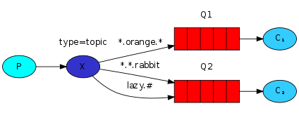

Although using the direct exchange improved our system, it still has limitations - it can't do routing based on <span style={{color: "var(--secondary-font-color)"}}> multiple criteria </span>.

In our logging system we might want to subscribe to not only logs based on severity, but also <span style={{color: "var(--secondary-font-color)"}}> based on the source which emitted </span> the log.

## Topic exchange

Messages sent to a topic exchange can't have an arbitrary `routing_key` - it <span style={{color: "var(--secondary-font-color)"}}> must be a list of words, delimited by dots </span>.

<Info>

Topic exchange is direct exchange with special format of routing key and binding key.

</Info>

The words can be anything, but usually they specify some features connected to the message.

Examples:

- `stock.usd.nyse`
- `nyse.vmw`
- `quick.orange.rabbit`

<Warning>

There can be as many words in the routing key as you like, up to the limit of 255 bytes.

</Warning>

<Note>

The binding key must also be in the same form.

</Note>

The logic behind the topic exchange is similar to a direct one - a message sent with a particular routing key will be delivered to all the queues that are bound with a matching binding key.

However there are two important special cases for <span style={{color: "var(--secondary-font-color)"}}> binding keys </span>:

- `*` (star) can substitute for exactly one word.
- `#` (hash) can substitute for zero or more words.

## Example



In this example, we're going to send messages which all describe animals.

The messages will be sent with a routing key that consists of three words (two dots).

The first word in the routing key will describe speed, second a colour and third a species: `<speed>.<colour>.<species>`.

We created three bindings: `Q1` is bound with binding key `*.orange.*` and Q2 with `*.*.rabbit` and `lazy.#`.

These bindings can be summarised as:

- `Q1` is interested in all the `orange` animals.
- `Q2` wants to hear everything about `rabbits`, and everything about `lazy` animals.

A message with a <span style={{color: "var(--secondary-font-color)"}}> routing key </span> set to `quick.orange.rabbit` will be delivered to both queues.

Message `lazy.orange.elephant` also will go to both of them.

On the other hand `quick.orange.fox` will <span style={{color: "var(--secondary-font-color)"}}> only </span> go to the first queue, and `lazy.brown.fox` <span style={{color: "var(--secondary-font-color)"}}> only </span> to the second.

`lazy.pink.rabbit` will be delivered to the second queue <span style={{color: "var(--primary-font-color)"}}> only once </span>, even though <span style={{color: "var(--secondary-font-color)"}}> it matches two bindings </span>.

`quick.brown.fox` <span style={{color: "var(--secondary-font-color)"}}> doesn't match any binding </span> so it will be <span style={{color: "var(--primary-font-color)"}}> discarded </span>.

What happens if we break our contract and send a message with one or four words, like `orange` or `quick.orange.male.rabbit`? Well, these <span style={{color: "var(--secondary-font-color)"}}> messages won't match any bindings </span> and <span style={{color: "var(--secondary-font-color)"}}> will be lost </span>.

On the other hand `lazy.orange.male.rabbit`, even though it has four words, will <span style={{color: "var(--secondary-font-color)"}}> match the last binding </span> `lazy.#` and will be <span style={{color: "var(--secondary-font-color)"}}> delivered to the second queue </span>.

<Note>

When a queue is bound with `#` (hash) binding key - it will <span style={{color: "var(--secondary-font-color)"}}> receive all the messages </span>, regardless of the routing key - like in fanout exchange.

</Note>

<Note>

When special characters `*` (star) and `#` (hash) <span style={{color: "var(--secondary-font-color)"}}> aren't used </span> <span style={{color: "var(--primary-font-color)"}}> in bindings </span>, the topic exchange will behave just like a direct exchange.

</Note>

## Code Example

We're going to use a topic exchange in our logging system.

We'll start off with a working assumption that the routing keys of logs will have two words: `<facility>.<severity>`.

### Publisher

```javascript title=emit_log_topic.js showLineNumbers
var amqp = require("amqplib/callback_api");

amqp.connect("amqp://localhost", function (error0, connection) {
  if (error0) {
    throw error0;
  }
  connection.createChannel(function (error1, channel) {
    if (error1) {
      throw error1;
    }
    var exchange = "topic_logs";
    var args = process.argv.slice(2);
    var key = args.length > 0 ? args[0] : "anonymous.info";
    var msg = args.slice(1).join(" ") || "Hello World!";

    channel.assertExchange(exchange, "topic", {
      durable: false,
    });
    channel.publish(exchange, key, Buffer.from(msg));
    console.log(" [x] Sent %s:'%s'", key, msg);
  });

  setTimeout(function () {
    connection.close();
    process.exit(0);
  }, 500);
});
```

### Subscriber

```javascript title=receive_logs_topic.js showLineNumbers
var amqp = require("amqplib/callback_api");

var args = process.argv.slice(2);

if (args.length == 0) {
  console.log("Usage: receive_logs_topic.js <facility>.<severity>");
  process.exit(1);
}

amqp.connect("amqp://localhost", function (error0, connection) {
  if (error0) {
    throw error0;
  }
  connection.createChannel(function (error1, channel) {
    if (error1) {
      throw error1;
    }
    var exchange = "topic_logs";

    channel.assertExchange(exchange, "topic", {
      durable: false,
    });

    channel.assertQueue(
      "",
      {
        exclusive: true,
      },
      function (error2, q) {
        if (error2) {
          throw error2;
        }
        console.log(" [*] Waiting for logs. To exit press CTRL+C");

        // highlight-start
        args.forEach(function (key) {
          // $ node emit_log_topic.js "kern.critical" "A critical kernel error"
          // key is routing key ("kern.critical" , "A critical kernel error" )
          channel.bindQueue(q.queue, exchange, key);
        });
        // highlight-end

        channel.consume(
          q.queue,
          function (msg) {
            console.log(
              " [x] %s:'%s'",
              msg.fields.routingKey,
              msg.content.toString()
            );
          },
          {
            noAck: true,
          }
        );
      }
    );
  });
});
```

### Running

#### Receive all logs

```bash title=
node receive_logs_topic.js '#'
```

#### To receive all logs from the facility `kern`:

```bash title=
node receive_logs_topic.js 'kern.*'
```

#### To receive all `critical` logs:

```bash title=
node receive_logs_topic.js '*.critical'
```

#### Subscriber with multiple bindings:

```bash title=
node receive_logs_topic.js 'kern.*' '*.critical'
```

#### Publisher with routing key `kern.critical`:

```bash title=
node emit_log_topic.js "kern.critical" "A critical kernel error"
```

<br />

---

# Sources

- https://www.rabbitmq.com/tutorials/tutorial-five-javascript.html
